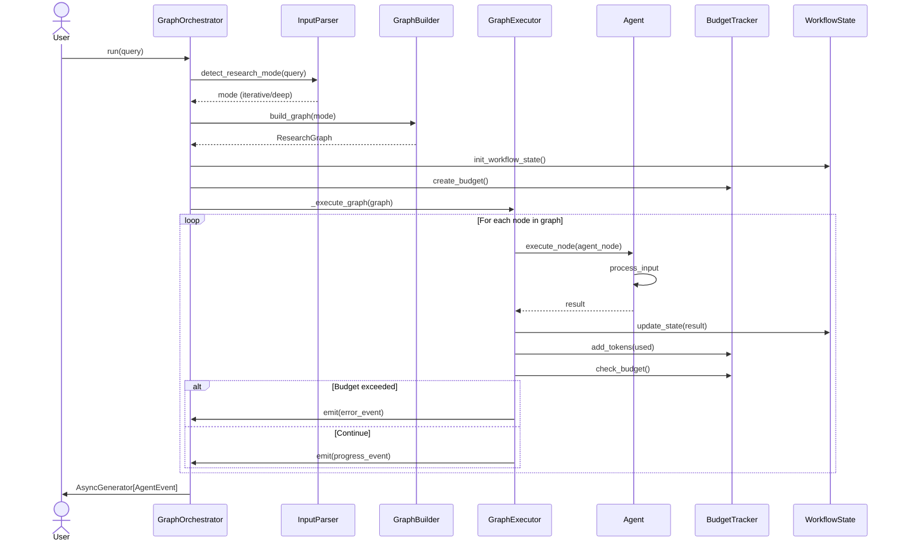
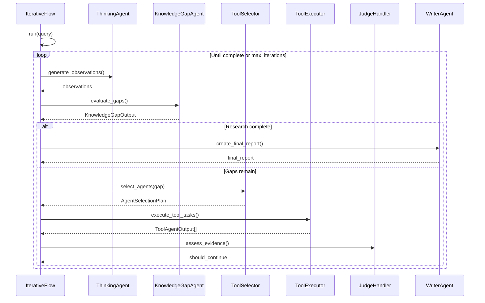

# Graph Orchestration Architecture

## Graph Patterns

### Iterative Research Graph

```
[Input] → [Thinking] → [Knowledge Gap] → [Decision: Complete?]
                                              ↓ No          ↓ Yes
                                    [Tool Selector]    [Writer]
                                              ↓
                                    [Execute Tools] → [Loop Back]
```

### Deep Research Graph

```
[Input] → [Planner] → [Parallel Iterative Loops] → [Synthesizer]
                           ↓         ↓         ↓
                        [Loop1]  [Loop2]  [Loop3]
```

### Deep Research



### Iterative Research




## Graph Structure

### Nodes

Graph nodes represent different stages in the research workflow:

1. **Agent Nodes**: Execute Pydantic AI agents
   - Input: Prompt/query
   - Output: Structured or unstructured response
   - Examples: `KnowledgeGapAgent`, `ToolSelectorAgent`, `ThinkingAgent`

2. **State Nodes**: Update or read workflow state
   - Input: Current state
   - Output: Updated state
   - Examples: Update evidence, update conversation history

3. **Decision Nodes**: Make routing decisions based on conditions
   - Input: Current state/results
   - Output: Next node ID
   - Examples: Continue research vs. complete research

4. **Parallel Nodes**: Execute multiple nodes concurrently
   - Input: List of node IDs
   - Output: Aggregated results
   - Examples: Parallel iterative research loops

### Edges

Edges define transitions between nodes:

1. **Sequential Edges**: Always traversed (no condition)
   - From: Source node
   - To: Target node
   - Condition: None (always True)

2. **Conditional Edges**: Traversed based on condition
   - From: Source node
   - To: Target node
   - Condition: Callable that returns bool
   - Example: If research complete → go to writer, else → continue loop

3. **Parallel Edges**: Used for parallel execution branches
   - From: Parallel node
   - To: Multiple target nodes
   - Execution: All targets run concurrently


## State Management

State is managed via `WorkflowState` using `ContextVar` for thread-safe isolation:

- **Evidence**: Collected evidence from searches
- **Conversation**: Iteration history (gaps, tool calls, findings, thoughts)
- **Embedding Service**: For semantic search

State transitions occur at state nodes, which update the global workflow state.

## Execution Flow

1. **Graph Construction**: Build graph from nodes and edges
2. **Graph Validation**: Ensure graph is valid (no cycles, all nodes reachable)
3. **Graph Execution**: Traverse graph from entry node
4. **Node Execution**: Execute each node based on type
5. **Edge Evaluation**: Determine next node(s) based on edges
6. **Parallel Execution**: Use `asyncio.gather()` for parallel nodes
7. **State Updates**: Update state at state nodes
8. **Event Streaming**: Yield events during execution for UI

## Conditional Routing

Decision nodes evaluate conditions and return next node IDs:

- **Knowledge Gap Decision**: If `research_complete` → writer, else → tool selector
- **Budget Decision**: If budget exceeded → exit, else → continue
- **Iteration Decision**: If max iterations → exit, else → continue

## Parallel Execution

Parallel nodes execute multiple nodes concurrently:

- Each parallel branch runs independently
- Results are aggregated after all branches complete
- State is synchronized after parallel execution
- Errors in one branch don't stop other branches

## Budget Enforcement

Budget constraints are enforced at decision nodes:

- **Token Budget**: Track LLM token usage
- **Time Budget**: Track elapsed time
- **Iteration Budget**: Track iteration count

If any budget is exceeded, execution routes to exit node.

## Error Handling

Errors are handled at multiple levels:

1. **Node Level**: Catch errors in individual node execution
2. **Graph Level**: Handle errors during graph traversal
3. **State Level**: Rollback state changes on error

Errors are logged and yield error events for UI.

## Backward Compatibility

Graph execution is optional via feature flag:

- `USE_GRAPH_EXECUTION=true`: Use graph-based execution
- `USE_GRAPH_EXECUTION=false`: Use agent chain execution (existing)

This allows gradual migration and fallback if needed.

## See Also

- [Orchestrators](orchestrators.md) - Overview of all orchestrator patterns
- [Workflow Diagrams](workflow-diagrams.md) - Detailed workflow diagrams
- [API Reference - Orchestrators](../api/orchestrators.md) - API documentation


